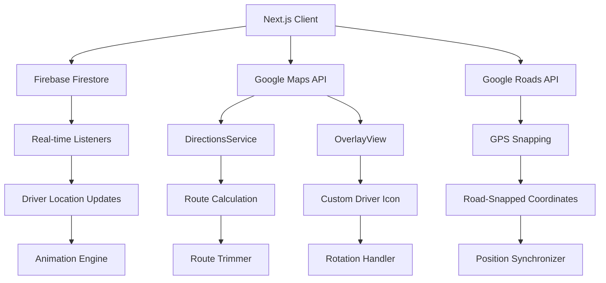

# Design Document: Google Maps Live Order Tracking

## Overview

This design document outlines the implementation of a production-grade Google Maps live order tracking system for Next.js (App Router) that provides real-time driver movement visualization similar to Blinkit/Zomato admin tracking. The system leverages Google Maps JavaScript API with Firebase Firestore real-time listeners to create a seamless tracking experience with animated custom driver icons, progressive route trimming, and synchronized polylines.

The architecture emphasizes performance optimization through strategic use of React useRef hooks, throttled updates, and efficient memory management to prevent re-renders and ensure smooth 60fps animations.

## Architecture

### High-Level Architecture



### Component Architecture

The system is built around a single main component `BlinkitOrderTracking` with the following key architectural patterns:

1. **Ref-Based State Management**: Critical map objects stored in useRef to prevent re-renders
2. **Event-Driven Updates**: Firestore listeners trigger cascading updates through the system
3. **Layered Rendering**: Custom overlays rendered above polylines with proper z-indexing
4. **Throttled Operations**: Performance-critical operations throttled to maintain 60fps

## Components and Interfaces

### Core Component Structure

```typescript
interface TrackingComponentState {
  // User and order identification
  userId: string | null
  orderId: string | null
  orderData: OrderData | null
  
  // UI state
  showSummary: boolean
  eta: string | null
  storeName: string | null
  restaurantNames: Record<string, string>
  loadingRestaurants: boolean
  userProfile: UserProfile | null
}

interface OrderData {
  status: 'grocerry_accepted' | 'driver_assigned' | 'in_transit' | 'delivered'
  address: {
    lat: number
    lng: number
    address: string
  }
  acceptedDriverDetails?: {
    driverLatLng: {
      lat: number
      lng: number
    }
    driverName: string
    driverPhone: string
  }
  items: OrderItem[]
  storeLat: number
  storeLng: number
}
```

### Custom Driver Overlay Implementation

```typescript
class DriverOverlay extends google.maps.OverlayView {
  private position: google.maps.LatLng
  private div: HTMLDivElement | null = null
  private rotation: number = 0
  
  constructor(position: google.maps.LatLng) {
    super()
    this.position = position
  }
  
  onAdd(): void {
    // Create DOM element with proper styling
    this.div = document.createElement("div")
    this.div.style.position = "absolute"
    this.div.style.width = "40px"
    this.div.style.height = "40px"
    this.div.style.transformOrigin = "50% 50%"
    this.div.style.willChange = "transform"
    this.div.style.pointerEvents = "none"
    this.div.style.zIndex = "9999"
    
    // Add driver icon image
    const img = document.createElement("img")
    img.src = "/img/driver_icon2.png"
    img.style.width = "100%"
    img.style.height = "100%"
    
    this.div.appendChild(img)
    this.getPanes().overlayLayer.appendChild(this.div)
  }
  
  draw(): void {
    const projection = this.getProjection()
    if (!projection || !this.div) return
    
    const point = projection.fromLatLngToDivPixel(this.position)
    if (!point) return
    
    // Position and rotate in single operation
    this.div.style.left = `${point.x - 20}px`
    this.div.style.top = `${point.y - 20}px`
    this.div.style.transform = `rotate(${this.rotation}deg)`
  }
  
  setPosition(pos: google.maps.LatLng): void {
    this.position = pos
    this.draw()
  }
  
  setRotation(deg: number): void {
    this.rotation = deg
    this.draw()
  }
}
```

### Route Management System

```typescript
interface RouteManager {
  // Core route operations
  generateRoute(origin: LatLng, destination: LatLng, waypoints: LatLng[]): Promise<RouteResult>
  trimRoute(routePath: LatLng[], driverPosition: LatLng): LatLng[]
  projectToRoute(routePath: LatLng[], position: LatLng): ProjectionResult
  
  // Animation and synchronization
  animateDriverMovement(from: LatLng, to: LatLng, heading: number): void
  synchronizePolylines(trimmedPath: LatLng[]): void
  
  // Performance optimization
  throttleRouteGeneration(): void
  cleanupPolylines(): void
}

interface ProjectionResult {
  nearestPoint: LatLng
  heading: number
  distanceFromRoute: number
  routeIndex: number
}
```

## Data Models

### Firebase Data Structure

```typescript
// Firestore path: Customer/{customerId}/current_order/{orderId}
interface FirestoreOrderDocument {
  status: OrderStatus
  address: CustomerAddress
  acceptedDriverDetails?: DriverDetails
  items: OrderItem[]
  storeLat: number
  storeLng: number
  createdAt: Timestamp
  updatedAt: Timestamp
}

interface DriverDetails {
  driverLatLng: {
    lat: number
    lng: number
    timestamp?: Timestamp
  }
  driverName: string
  driverPhone: string
  driverId: string
}

interface CustomerAddress {
  lat: number
  lng: number
  address: string
  landmark?: string
}
```

### Google Maps API Data Models

```typescript
interface DirectionsRequest {
  origin: LatLng
  destination: LatLng
  waypoints: DirectionsWaypoint[]
  optimizeWaypoints: boolean
  travelMode: TravelMode
  drivingOptions: {
    departureTime: Date
    trafficModel: 'bestguess' | 'pessimistic' | 'optimistic'
  }
}

interface RouteVisualization {
  polylineSegments: google.maps.Polyline[]
  trafficColors: {
    normal: '#48BBDB'
    slow: '#ff0000'
    moderate: '#ffa500'
  }
  driverOverlay: DriverOverlay
  markers: {
    store: google.maps.Marker[]
    customer: google.maps.Marker
  }
}
```

## Correctness Properties

*A property is a characteristic or behavior that should hold true across all valid executions of a system-essentially, a formal statement about what the system should do. Properties serve as the bridge between human-readable specifications and machine-verifiable correctness guarantees.*

Now I'll analyze the acceptance criteria to determine which ones can be tested as properties:

### Property Reflection

After analyzing all acceptance criteria, I identified several areas where properties can be consolidated for better testing efficiency:

**Consolidation Opportunities:**
- Properties 12.2, 12.3, 12.4 (traffic color mapping) can be combined into a single comprehensive traffic color property
- Properties 3.5 and 3.6 (overlay stability) can be combined into a single overlay stability property  
- Properties 6.1, 6.2, 6.3 (synchronization sequence) can be combined into a single synchronization property
- Properties 4.4 and 4.5 (DirectionsService configuration) can be combined into a single route configuration property

**Unique Value Properties:**
Each remaining property provides distinct validation value and should be maintained separately.

### Converting EARS to Properties

Based on the prework analysis, here are the key correctness properties that will ensure the system behaves correctly:

**Property 1: Map Theme Configuration**
*For any* map initialization, the map instance should have custom theme styling applied with the specified water, roads, landscape, POI, and label configurations
**Validates: Requirements 1.1, 1.3**

**Property 2: API Library Loading**
*For any* Google Maps API initialization, the places and geometry libraries should be loaded and available in the global window object
**Validates: Requirements 1.2**

**Property 3: Firestore Listener Path**
*For any* valid customerId and orderId, the Firestore listener should be created with the path Customer/{customerId}/current_order/{orderId}
**Validates: Requirements 2.1**

**Property 4: Driver Location Extraction**
*For any* Firestore document with acceptedDriverDetails, the system should correctly extract lat/lng coordinates from acceptedDriverDetails.driverLatLng
**Validates: Requirements 2.2**

**Property 5: GPS Coordinate Snapping**
*For any* raw GPS coordinates, the system should process them through Google Roads API and return road-snapped coordinates
**Validates: Requirements 2.3**

**Property 6: Location Update Throttling**
*For any* sequence of location updates, the system should throttle updates to prevent excessive API calls within the specified time window
**Validates: Requirements 2.4**

**Property 7: Coordinate Validation**
*For any* location data received, invalid coordinates should be rejected and valid coordinates should be accepted for processing
**Validates: Requirements 2.5**

**Property 8: Driver Overlay Implementation**
*For any* driver representation on the map, it should be an instance of Google Maps OverlayView, not a default marker
**Validates: Requirements 3.1**

**Property 9: Driver Icon Source**
*For any* driver overlay, the contained image element should have src="/img/driver_icon2.png"
**Validates: Requirements 3.2**

**Property 10: Driver Rotation Calculation**
*For any* driver movement along a route, the rotation angle should be calculated using google.maps.geometry.spherical.computeHeading
**Validates: Requirements 3.3, 5.2**

**Property 11: Animation Frame Usage**
*For any* driver movement animation, the system should use requestAnimationFrame rather than CSS transitions
**Validates: Requirements 3.4**

**Property 12: Overlay Stability During Zoom**
*For any* map zoom operation, the driver overlay should maintain stable position and rotation with draw operations throttled to maximum 60fps
**Validates: Requirements 3.5, 3.6**

**Property 13: Overlay Z-Index Priority**
*For any* driver overlay, its z-index should be higher than polyline z-index to ensure visibility
**Validates: Requirements 3.7**

**Property 14: Route Generation Trigger**
*For any* order with available driver location, the system should generate a route using Google DirectionsService
**Validates: Requirements 4.1**

**Property 15: Route Configuration**
*For any* DirectionsService request, it should have optimizeWaypoints: true and trafficModel: "bestguess"
**Validates: Requirements 4.2, 4.4, 4.5**

**Property 16: Waypoint Collection**
*For any* order with multiple restaurant items, the system should fetch restaurant locations from Firestore and add them as waypoints
**Validates: Requirements 4.3**

**Property 17: Route Path Storage**
*For any* successful route calculation, the overview_path should be stored in routePathRef
**Validates: Requirements 4.6**

**Property 18: Route Regeneration Throttling**
*For any* sequence of route requests, full route regeneration should not occur more frequently than every 30 seconds
**Validates: Requirements 4.7**

**Property 19: Driver Position Projection**
*For any* driver location update, the GPS position should be projected onto the nearest point on the route polyline
**Validates: Requirements 5.1**

**Property 20: Route Trimming Logic**
*For any* driver position on a route, the trimmed route should start exactly from the driver's projected position and include only remaining segments
**Validates: Requirements 5.3, 5.4, 5.5**

**Property 21: Forward Movement Constraint**
*For any* sequence of driver position updates, the driver's position along the route should only move forward, never backward
**Validates: Requirements 5.6**

**Property 22: Update Synchronization Sequence**
*For any* driver position update, polylines should be redrawn first, then the driver overlay should be moved to the same projected point, ensuring they never desync
**Validates: Requirements 6.1, 6.2, 6.3**

**Property 23: Animation Easing**
*For any* driver movement animation, the system should use easeInOutCubic easing function with manual lat/lng interpolation
**Validates: Requirements 6.4, 6.5**

**Property 24: Rotation Wrap-Around**
*For any* rotation calculation, values should wrap correctly around 360 degrees to prevent spinning
**Validates: Requirements 6.6**

**Property 25: Order Status Conditional Rendering**
*For any* order with status "grocerry_accepted", only a straight polyline from store to customer should be displayed; when driver is assigned, animated route with ETA should be shown
**Validates: Requirements 7.1, 7.2**

**Property 26: Marker Display Completeness**
*For any* active order, appropriate markers should be displayed for all relevant entities (stores, customer, driver when available)
**Validates: Requirements 7.3**

**Property 27: ETA Calculation Accuracy**
*For any* calculated route, the ETA should be computed by summing all legs[].duration.value, converted to minutes, with a minimum of 1 minute
**Validates: Requirements 8.1, 8.2, 8.4**

**Property 28: ETA Reactive Updates**
*For any* route or traffic condition change, the ETA display should update accordingly
**Validates: Requirements 8.3**

**Property 29: UI Information Display**
*For any* active order, the header should show order ID and customer name, and driver panel should show driver details when available
**Validates: Requirements 9.1, 9.2**

**Property 30: Map Bounds Fitting**
*For any* re-center operation, the map bounds should include both driver and customer locations
**Validates: Requirements 9.4**

**Property 31: Ref-Based State Management**
*For any* critical map objects (mapInstance, overlays, route data), they should be stored in useRef rather than component state
**Validates: Requirements 10.1**

**Property 32: Resource Cleanup**
*For any* component unmount, Firestore listeners should be unsubscribed and map objects should be properly disposed
**Validates: Requirements 10.2, 10.3**

**Property 33: Error Handling Resilience**
*For any* API failure (Google Maps, Firestore, GPS), the system should display appropriate error messages or attempt recovery without breaking the user experience
**Validates: Requirements 11.1, 11.2, 11.3, 11.4, 11.5**

**Property 34: Traffic Color Visualization**
*For any* route segment, polyline color should match traffic speed: red for speed < 2, orange for speed < 4, blue for normal conditions, and colors should update when route is recalculated
**Validates: Requirements 12.1, 12.2, 12.3, 12.4, 12.5**

## Error Handling

### Error Categories and Strategies

**1. Google Maps API Errors**
- **Loading Failures**: Display fallback message with retry option
- **Quota Exceeded**: Implement exponential backoff and user notification
- **Invalid API Key**: Show configuration error message

**2. Firebase Connectivity Errors**
- **Network Disconnection**: Implement automatic reconnection with exponential backoff
- **Permission Denied**: Redirect to authentication flow
- **Document Not Found**: Show "Order not found" message

**3. GPS and Location Errors**
- **Invalid Coordinates**: Use fallback coordinates and log error
- **Roads API Failures**: Use raw coordinates as fallback
- **Projection Errors**: Skip update and maintain last known position

**4. Route Calculation Errors**
- **No Route Found**: Retry with simplified parameters (remove waypoints)
- **Service Unavailable**: Show estimated straight-line distance
- **Timeout**: Implement request timeout and retry logic

### Error Recovery Mechanisms

```typescript
interface ErrorRecoveryStrategy {
  maxRetries: number
  backoffMultiplier: number
  fallbackBehavior: () => void
  userNotification: string
}

const errorStrategies: Record<string, ErrorRecoveryStrategy> = {
  'MAPS_API_LOAD_FAILED': {
    maxRetries: 3,
    backoffMultiplier: 2,
    fallbackBehavior: () => showStaticMap(),
    userNotification: 'Map loading failed. Showing simplified view.'
  },
  'FIRESTORE_CONNECTION_LOST': {
    maxRetries: 5,
    backoffMultiplier: 1.5,
    fallbackBehavior: () => showLastKnownState(),
    userNotification: 'Connection lost. Attempting to reconnect...'
  }
}
```

## Testing Strategy

### Dual Testing Approach

The testing strategy employs both unit tests and property-based tests to ensure comprehensive coverage:

**Unit Tests Focus:**
- Specific examples of driver movement scenarios
- Edge cases like invalid coordinates or network failures
- Integration points between Google Maps API and Firebase
- UI component rendering with different order states

**Property-Based Tests Focus:**
- Universal properties that hold across all inputs
- Route calculation correctness across random coordinates
- Animation smoothness across various movement patterns
- Synchronization between driver icon and polylines

### Property-Based Testing Configuration

**Testing Framework**: fast-check (JavaScript property-based testing library)
**Minimum Iterations**: 100 per property test
**Test Tagging Format**: **Feature: google-maps-live-tracking, Property {number}: {property_text}**

**Example Property Test Structure:**
```typescript
import fc from 'fast-check'

describe('Google Maps Live Tracking Properties', () => {
  it('Property 5: GPS Coordinate Snapping', async () => {
    // Feature: google-maps-live-tracking, Property 5: GPS coordinate snapping
    await fc.assert(fc.asyncProperty(
      fc.record({
        lat: fc.float({ min: -90, max: 90 }),
        lng: fc.float({ min: -180, max: 180 })
      }),
      async (coords) => {
        const snapped = await snapDriverToRoad(coords.lat, coords.lng)
        
        // Property: Snapped coordinates should be valid
        expect(snapped.lat).toBeGreaterThanOrEqual(-90)
        expect(snapped.lat).toBeLessThanOrEqual(90)
        expect(snapped.lng).toBeGreaterThanOrEqual(-180)
        expect(snapped.lng).toBeLessThanOrEqual(180)
      }
    ), { numRuns: 100 })
  })
})
```

### Performance Testing

**Animation Performance:**
- Verify 60fps during driver movement
- Measure memory usage during long tracking sessions
- Test with multiple simultaneous route updates

**API Rate Limiting:**
- Verify throttling prevents excessive Google Maps API calls
- Test Firestore listener efficiency with rapid updates
- Measure response times under various network conditions

### Integration Testing

**End-to-End Scenarios:**
- Complete order tracking flow from assignment to delivery
- Driver movement along complex multi-waypoint routes
- Network disconnection and reconnection scenarios
- Map zoom and pan operations during active tracking

**Cross-Browser Compatibility:**
- Test on Chrome, Firefox, Safari, Edge
- Verify mobile browser performance
- Test with different screen sizes and orientations